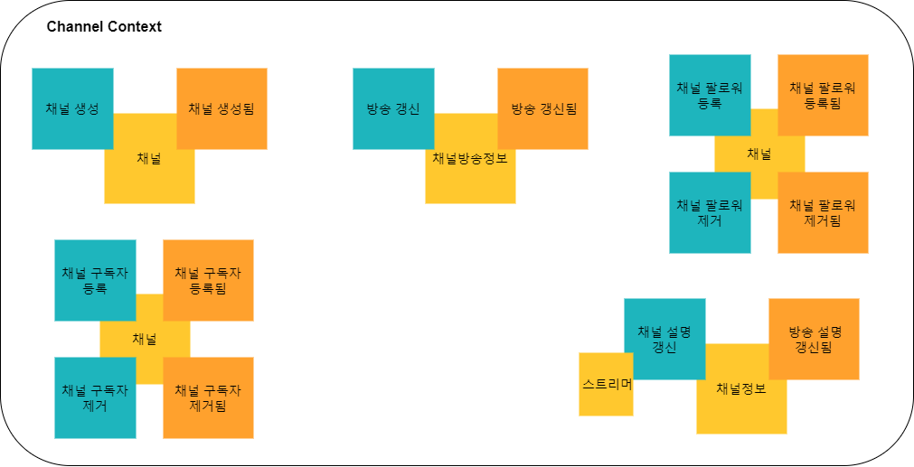
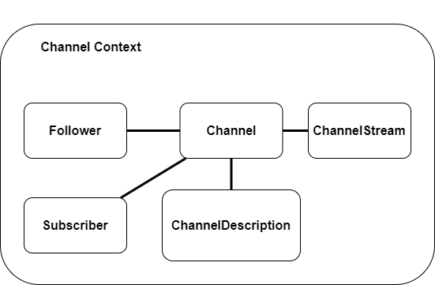

# mystream-channel
mystream channel service

## 요구사항

  - 채널
    - 채널의 이름은 사용자의 이름으로 지정됨
    - 회원은 자신의 채널 정보 텍스트를 설정하거나 변경할 수 있음
      - 채널의 정보는 255 글자 미만으로 설정이 가능
    - 채널은 현재 및 이전 방송의 정보를 기록하고 있음
    - 채널은 자신을 팔로우한 회원들을 저장하고 있음
    - 채널은 자신을 구독한 회원들을 저장하고 있음

## mystream-channel

### Event Storming

### Context Map

### Domain Modeling

### Entity Modeling

### Table Modeling

